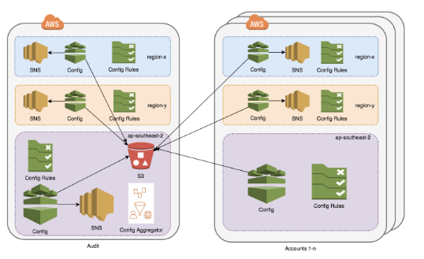

<!-- vim: set ft=markdown: -->
# terraform-aws-config

#### Table of contents

1. [Overview](#overview)
2. [Terraform AWS Config - Overview Diagram](#terraform-aws-config---overview-diagram)
3. [Terraform AWS Config](#terraform-aws-config)
    * [Resources docs](#resources-docs)
    * [Inputs](#inputs)
    * [Outputs](#outputs)
    * [Examples](#examples)
        - [Aggregator Account](#aggregator-account)
        - [Source Account](#source-account)
4. [License](#license)

## Overview

AWS Config catpures point in time snapshots of the environment to allow for point in time review of configuration. Additionally AWS Config can be utilised for automated action using AWS Config rules.

NOTE: Currently only supports AWS owned / managed rules - http://docs.aws.amazon.com/config/latest/developerguide/managed-rules-by-aws-config.html

Terraform >= 0.12.6 is required for this module.

## Terraform AWS Config - Overview Diagram



## Terraform AWS Config

### Resources docs

Terraform AWS Config automation includes use of the following core Terraform resources:

- [`aws_config_aggregate_authorization`](https://www.terraform.io/docs/providers/aws/r/aws_config_aggregate_authorization.html) - Manages an AWS Config Aggregate Authorization.
- [`aws_config_configuration_aggregator`](https://www.terraform.io/docs/providers/aws/r/aws_config_configuration_aggregator.html) - Manages an AWS Config Configuration Aggregator.
- [`aws_config_config_rule`](https://www.terraform.io/docs/providers/aws/r/config_config_rule.html) - Provides an AWS Config Rule.
- [`aws_config_configuration_recorder_status`](https://www.terraform.io/docs/providers/aws/r/aws_config_configuration_recorder_status.html) - Manages status (recording / stopped) of an AWS Config Configuration Recorder.
- [`aws_config_configuration_recorder`](https://www.terraform.io/docs/providers/aws/r/config_configuration_recorder.html) - Provides an AWS Config Configuration Recorder.
- [`aws_config_delivery_channel`](https://www.terraform.io/docs/providers/aws/r/config_delivery_channel.html) - Provides an AWS Config Delivery Channel.

### Inputs

The below outlines the current parameters and defaults.

| Name | Description | Type | Default | Required |
|------|-------------|:----:|:-------:|:--------:|
|delivery_frequency|The frequency with which AWS Config recurringly delivers configuration snapshots. May be one of One_Hour, Three_Hours, Six_Hours, Twelve_Hours, or TwentyFour_Hours|string|TwentyFour_Hours|No|
|enable_recorder|Whether the configuration recorder should be enabled or disabled|bool|true|No|
|expiration|The number of days to wait before expiring an object|number|2555|No|
|transition_to_glacier|The number of days to wait before transitioning an object to Glacier|number|30|No|
|is_aggregator|Whether the account is to be an aggregator or not|bool|false|No|
|aggregator_account_id|The AWS Account ID of the aggregator account|string|null|No|
|aggregator_account_region|The AWS Region of the aggregator account|string|null|No|
|source_account_ids|List of 12-digit account IDs of the accounts being aggregated|list(string)|[]|No|
|bucket_name|The bucket name - required by both aggregator and source accounts|string|""|Yes|
|config_rules|A list of config rules. By not specifying, a minimum set of recommended rules are applied|map(any)|(map)|No|

### Outputs

|Name|Description|
|------------|---------------------|
|bucket|The bucket name that config writes output to|
|bucket_arn|The bucket ARN that config writes output to|
|delivery_channel_id|The name of the delivery channel|
|recorder_id|Name of the recorder|
|topic_arn|The ARN of the SNS topic AWS Config writes events to|

### Examples

#### Aggregator Account

A Config account configured as an Aggregator:

```tf
variable "aggregator_account_id" {}
variable "source_account_id" {}

variable "bucket_name" {}

module "aggregator" {
  source                    = "git@github.com:cmdlabs/terraform-aws-config.git"
  is_aggregator             = true
  aggregator_account_id     = var.aggregator_account_id
  aggregator_account_region = "ap-southeast-2"
  source_account_ids        = [var.source_account_id]
  bucket_name               = var.bucket_name
}
```

To apply that:

```text
▶ export TF_VAR_bucket_name=config-bucket-"$(uuidgen | tr 'A-Z' 'a-z')"  # bucket name must be globally unique
▶ TF_VAR_aggregator_account_id=xxxxxxxxxxxx TF_VAR_source_account_id=yyyyyyyyyyyy terraform apply
```

#### Source Account

Then a Config Source that points to its S3 bucket:

```tf
variable "bucket_name" {}

module "source" {
  source        = "git@github.com:cmdlabs/terraform-aws-config.git"
  is_aggregator = false
  bucket_name   = var.bucket_name
}
```

To apply that:

```text
# $TF_VAR_bucket_name set from above.
▶ terraform apply
```

## License

Apache 2.0.
